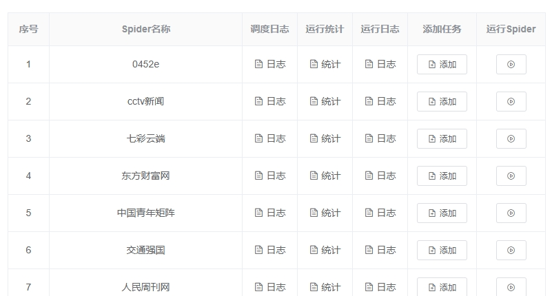
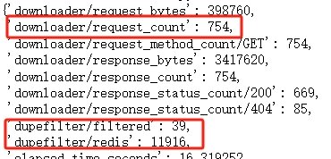

# scrapy_konne

小组内部使用Scrapy项目


## 主要组件

- `core/`: 包含了项目的核心功能，如中间件、调度器、序列化器、信号和爬虫。
- `middlewares/`: 包含了项目的中间件，如 JavaScript 和代理中间件。
- `http/` 包含了自定义的请求对象。
- `pipelines/`: 包含了项目的管道，用于对item进行格式化、校验、去重、上传等。
- `extensions/`: 包含了项目的扩展，如日志统计扩展、微信机器人、全局redis对象等。
- `utils/`: 包含了项目的工具函数。

## 安装依赖

可以使用pip直接安装包

```sh
pip install git+https://github.com/dream2333/scrapy_konne.git
```


如果安装了 Poetry。可以使用以下命令安装项目的依赖：

```sh
poetry add git+https://github.com/dream2333/scrapy_konne.git#main
```

然后在scrapy项目脚手架中配置好settings.py，添加相应的中间件和pipeline

## 示例爬虫-凤凰资讯APP
### 创建板块类爬虫

首先，我们需要创建一个Scrapy爬虫。在Scrapy中，爬虫是一个定义了如何爬取某个(或某些)网站的类。它的主要职责是生成请求（Request对象）、提取数据（item对象）。我们将以``凤凰资讯APP``爬虫为例，介绍如何使用Scrapy编写爬虫。

在我们的例子中，爬虫的定义如下：
```python
from scrapy import Spider

class FengHuangShanXiaIncreament(Spider):
    name = "凤凰资讯APP"
    site_id = 36
    client_id = "fenghuangzixun_app_section_1"
```

首先，对于板块爬虫，我们需要导入``Spider``类，然后定义一个类，继承自``Spider``类，类名可以随意，不影响代码运行
```python
from scrapy import Spider
class FengHuangShanXiaIncreament(Spider):
```

接着，我们需要定义一些属性，这些属性是爬虫的配置信息，如爬虫的名称、日志ID等
```python
name = "凤凰资讯APP"
site_id = 36
client_id = "fenghuangzixun_app_section_1"
```

``name``属性是爬虫的名称，当我们编写完爬虫后，我们可以使用命令运行爬虫（也可以通过项目下的dev.py）：

```sh
scrapy crawl 凤凰资讯APP
```
``name``还会显示在web监控中，用于区分不同的爬虫，此处建议使用中文名，方便查看



``site_id`` ``client_id``是爬虫对应的日志ID，用于对接康奈的微信板块日志系统


### 编写爬虫解析函数

```python
def start_requests(self):
    sources = [
        {"name": "资讯", "url": "https://inews.ifeng.com/?srctag=xzydh1"},
        {"name": "娱乐", "url": "https://ient.ifeng.com/?srctag=xzydh2"},
    ]
    for source in sources:
        yield KRequest(source["url"], cb_kwargs={"section_name": source["name"]})
```

#### 定义初始请求
爬虫需要定义一个``start_requests``方法，用于生成初始的请求。``start_requests``必须为一个生成器，或返回一个可迭代对象，该对象包含了爬虫用于爬取的第一个请求。在这里，我们使用生成器的形式，生成了两个请求，分别对应资讯和娱乐板块的URL。

```python
def start_requests(self):
    ...
    for source in sources:
        yield KRequest(source["url"]，cb_kwargs=...)
```
`KRequest`是我们自定义的请求对象，意为`KonneRequest`。`KRequest`继承自`scrapy.Request`，含有一些拓展功能，我们在后文会提到

`yield`出去的`Request`对象会被`scrapy调度器`调度，然后发送请求到`下载器`中异步下载。下载完成会调用Request对象的`回调方法`，此处未填写回调方法，Request默认的回调方法是`parse`方法，

此外，我们还填写了一个cb_kwargs参数，这个参数可以传递额外的数据到回调方法中

#### 第一层回调方法
```python
    ...
    for source in sources:
        # yield出去的Request对象会被scrapy调度器调度，然后发送请求到下载器中异步下载
        # 下载完成会调用回调方法，此处未填写回调方法，默认的回调方法是parse方法
        # cb_kwargs参数可以传递额外的参数到回调方法中
        yield KRequest(source["url"], cb_kwargs={"section_name": source["name"]})

# 对板块页面进行解析,section_name是通过cb_kwargs传递过来的
def parse(self, response: HtmlResponse, section_name: str):
    data = response.selector.re_first(r"var allData =([\s\S]*);[\s\S]+var adKeys =")
    json_data = json.loads(data)
    article_list = json_data["newsstream"]
    for article in article_list:
        # 通过DetailDataItem类封装数据，这样可以自动进行数据校验和类型转换
        # 时间可以填入10位、13位时间戳、字符串，也可以填入datetime对象
        item = DetailDataItem(
            title=article["title"],
            source_url=article["url"],
            publish_time=article["newsTime"],
            source=f"凤凰资讯APP-{section_name}",
        )
        # 将item也携带到下一级页面，这样在解析详情页时可以直接使用item
        yield KRequest(article["url"], cb_kwargs={"item": item}, callback=self.parse_detail)
```
默认的回调函数只接受一个`response`参数，是请求下载完成后得到的响应对象
```python
def parse(self, response):
```
然而，我们定义的`parse`方法，多了一个参数。此处的`section_name`参数是通过`cb_kwargs`额外传递过来的，这样子我们就可以在不同的回调之间传递数据了
```python
def parse(self, response: HtmlResponse, section_name: str):
```
*网络上的scrapy教程通常会教你使用meta参数传递数据，这是不合规范的一种做法，因为meta通常用于中间件之间传递元数据，可能会导致中间件的数据覆盖了你的参数。在传递参数时，我们尽量使用cb_kwargs*


进入回调函数后，我们可以用多种方式解析数据：
```python
data = response.xpath("//div/text()").getall()
data = response.selector.re(r"var allData =([\s\S]*);[\s\S]+var adKeys =")
data = response.jmespath("data[*].title").getall()
data = response.css("div::text").getall()
```

甚至支持不同解析方式的链式调用：
```python
data = response.jmespath("[*].html").xpath("//div[@class='content']").getall()
```

我们将数据解析后，填入`DetailDataItem`对象，这样可以自动进行数据校验和类型转换，防止上传空数据或错误数据类型、过期数据

例如，时间可以填入10位、13位时间戳、字符串，也可以填入datetime对象，`DetailDataItem`会自动转换为统一的时间格式，并校验数据是否过期

因为这一层仅仅请求的是列表页，并不含有作者和内容信息，所以最后，我们将`item`对象也携带到下一级页面
```python
for article in article_list:
    item = DetailDataItem(
        title=article["title"],
        source_url=article["url"],
        publish_time=article["newsTime"],
        source=f"凤凰资讯APP-{section_name}",
    )
    # 将item也携带到下一级页面，这样在解析详情页时可以直接使用item
    yield KRequest(article["url"], cb_kwargs={"item": item}, callback=self.parse_detail)
```
#### 第二层回调方法
在这一层，我们解析详情页，补全仅剩的字段，并将item对象yield出去，这样就完成了一次爬取，框架会自动帮我们完成去重、上传、检测、日志提交等操作。
```python
def parse_detail(self, response: HtmlResponse, item: DetailDataItem):
    item.content = response.xpath("string(//div[contains(@class,'index_main_content')])").get()
    item.author = response.xpath("string(//span[contains(@class,'index_source')])").get().strip()
    yield item
```
同一套代码，本地环境和生产环境是区分开来的，本地的数据会被导出到`items.csv`和控制台，不会上传到生产环境，所以可以放心调试

### 高级用法：请求去重和轮转代理池
```python
        ...
        yield KRequest(
            article["url"],
            filter_url=item.source_url,
            rotate_proxy=True,
            cb_kwargs={"item": item}, 
            callback=self.parse_detail
        )

# 解析详情页，补全仅剩的字段
def parse_detail(self, response: HtmlResponse, item: DetailDataItem):
    item.content = response.xpath("string(//div[contains(@class,'index_main_content')])").get()
    item.author = response.xpath("string(//span[contains(@class,'index_source')])").get().strip()
    yield item
```
注意这个请求，添加了`filter_url`和`rotate_proxy`
```python
yield KRequest(
    article["url"],
    filter_url=item.source_url,
    rotate_proxy=True,
    cb_kwargs={"item": item}, 
    callback=self.parse_detail
)
```
`rotate_proxy`设为`True`时，会自动从代理池中获取代理，每次请求都会使用不同的代理，这样可以避免被封IP

`filter_url`的用法则相应麻烦一些，如果这个请求可以请求到item，可以将item的`source_url`填入`filter_url`，中间件在获取到请求对象时，会到去重库中读取是否已经入库过相应的item，如果已经入库了，就不会将这个请求交给下载器下载



如图为东方财富网案例，有一万多个请求被去重器去重掉了，整个爬虫仅运行了10秒，仅有754个请求经过了下载器。如果不添加filter_url，则所有的请求都会被下载，最后只有在入库前才会在pipeline中去重，这样会浪费大量的资源

## 本地运行
两种方式，命令行或者使用dev.py运行
```sh
scrapy crawl <spider_name>
```
```sh
python dev.py
```

## 部署
修改deploy.py中的项目名，然后单击运行即可部署至远程服务端

### web中台
在中台添加计划任务后，爬虫就可以运行了，可以在web中台查看爬虫的运行情况，包括爬取的数据量、错误日志、运行时间等

## 贡献

欢迎对项目进行贡献。如果你有任何问题或建议，请提交 issue 或 pull request。